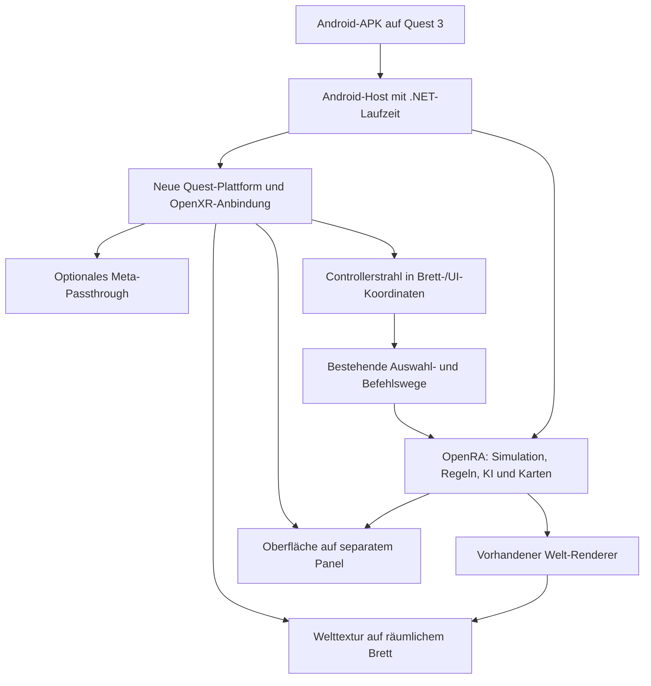

# OpenRA auf Quest 3: Machbarkeitsprüfung

Stand: 25. September 2026. Ziel: eigenständige Meta-Quest-3-App, Installation als APK über SideQuest, Tabletop-Spiel mit optionalem Passthrough. Die ARM64-Diagnose-APK wurde auf einer Quest 3 gestartet und lädt inzwischen 307 Red-Alert-Akteure, 89 Waffen und die 98×98-Karte „Blitz“. OpenRAs `Renderer` zeichnet die Geländetyp-Farben über seinen Weltpuffer und einen selbst erzeugten Markierungs-Sprite; die UI-Komposition und Schriftausgabe mit `SpriteFont` funktionieren auf dem Gerät. Ein spielbarer oder räumlich dargestellter OpenRA-Prototyp existiert noch nicht.

## Ergebnis

Ein OpenRA-Fork mit nativer Android-/OpenXR-Unterstützung ist ein technisch plausibles Entwicklungsprojekt. Ein Spielbrett mit Originalgrafik und Controller-Bedienung ist der risikoärmste erste Meilenstein. Ein Diorama aus Sprites ist ein weiterer Renderer-Ausbau. Eine vollständig dreidimensionale Umsetzung der klassischen Spiele braucht zusätzlich passende Modelle und eine weitreichendere Anpassung der Darstellung.

SideQuest ist ein geeigneter Installationsweg für die fertige APK. Es löst die Portierung selbst nicht. Der Rechner würde nur für Entwicklung, Installation und gegebenenfalls die Übertragung der Spieldaten benötigt; die Zielversion berechnet und zeichnet das Spiel auf der Quest.

[Tiberian Dawn for Android and Meta Quest](https://github.com/Cesarus85/Tiberian-Dawn-for-Android-and-Meta-Quest) ist inzwischen ein besonders passender Vergleich für das gewünschte Erlebnis: Der eigenständige Quest-Build zeigt das klassische 2D-Spiel in räumlichen, verschiebbaren Fenstern und importiert rechtmäßig vorhandene Originaldaten getrennt von der APK. Das Projekt nutzt eine andere Engine als OpenRA; seine Android-/XR-Architektur und Bedienung sind Referenzen, keine direkt übernehmbaren OpenRA-Module. [Generals: Zero Hour XR](https://github.com/Cesarus85/Generals-Zero-Hour-XR) demonstriert ergänzend ein stereoskopisches 3D-Tabletop auf Quest.

## Untersuchte Grundlagen

Die Quellcodeprüfung umfasst ausgewählte Plattform-, Grafik-, Eingabe- und Laufzeitdateien. Sie ist kein vollständiges Audit beider Projekte.

| Projekt | Geprüfter Commit |
| --- | --- |
| OpenRA/OpenRA | `f3ec7f8e1593b482f85fd101652deb740c33dee6` |
| Cesarus85/Generals-Zero-Hour-XR | `e7739c32baebd605109d13dc6b9f60c5168c668a` |

Die ausgewählten Quelldateien und ihre ursprünglichen URLs sind in [research/2026-09-25/sources.json](research/2026-09-25/sources.json) dokumentiert. Generierte Graphify-Ausgaben dienen zur Orientierung; konkrete Aussagen unten wurden am Quellcode geprüft.

### Was OpenRA bereits mitbringt

1. **Eine eigene Plattform-Schnittstelle.** `IPlatform`, `IPlatformWindow` und `IGraphicsContext` trennen Fenster, Grafik, Schrift und Ton von vielen Teilen der Engine. Eine zusätzliche Implementierung, beispielsweise `OpenRA.Platforms.Quest`, passt zu dieser Struktur. Die Schnittstellen enthalten weiterhin Desktop-Annahmen, und `Game.CreatePlatform` lädt die Plattform dynamisch. Ein Plattformmodul allein genügt deshalb nicht. [PlatformInterfaces.cs](https://github.com/OpenRA/OpenRA/blob/f3ec7f8e1593b482f85fd101652deb740c33dee6/OpenRA.Game/Graphics/PlatformInterfaces.cs#L26), [Game.cs](https://github.com/OpenRA/OpenRA/blob/f3ec7f8e1593b482f85fd101652deb740c33dee6/OpenRA.Game/Game.cs#L461)

2. **OpenGL ES ist schon vorgesehen.** Das Profil `GLProfile.Embedded` fordert einen OpenGL-ES-3.0-Kontext an; die Shader wählen dafür `300 es`. Die Quest-Probe erstellt einen GLES-3.2-Kontext, löst 74 von 74 im GLES-Profil genutzten OpenRA-GL-Funktionen über Android/EGL auf und initialisiert OpenRAs vorhandenes GL-Binding. `Texture`, `Shader`, `VertexBuffer`, `StaticIndexBuffer` und `FrameBuffer` laufen auf dem Gerät; mit dem originalen `combined`-Shader wurde eine 98×98-Terrain-Farbkarte aus 19.208 Dreiecken gezeichnet. Ein diagnostischer Android-Plattformadapter startet auch OpenRAs `Renderer` mit Weltpuffer, UI-Komposition und synthetischem Sprite. Auf dem getesteten Gerät sind `GL_EXT_texture_format_BGRA8888`, `GL_OES_standard_derivatives`, `GL_EXT_read_format_bgra` und `GL_KHR_debug` vorhanden. Das reduziert das Risiko eines vollständigen Grafik-API-Wechsels, ersetzt aber noch nicht OpenRAs `WorldRenderer` mit echten Tiles und Spielsprites. Android-Kontextverwaltung für den Spielrenderer und XR-Swapchains müssen geprüft werden. [Sdl2PlatformWindow.cs](https://github.com/OpenRA/OpenRA/blob/f3ec7f8e1593b482f85fd101652deb740c33dee6/OpenRA.Platforms.Default/Sdl2PlatformWindow.cs#L534), [Shader.cs](https://github.com/OpenRA/OpenRA/blob/f3ec7f8e1593b482f85fd101652deb740c33dee6/OpenRA.Platforms.Default/Shader.cs#L31)

3. **Die Welt wird bereits in eine eigene Textur gerendert.** `Renderer.BeginWorld` bindet einen Welt-Framebuffer; `BeginUI` zeichnet diesen bisher in den Bildschirm-Framebuffer. Hier lässt sich die Spielwelt für ein räumliches Brett abgreifen. Für ein separates UI-Panel müsste die bestehende Komposition angepasst werden, damit das Weltbild nicht zusätzlich im UI erscheint. Die Aufteilung schafft noch keine unabhängigen Render-Schleifen. [Renderer.cs](https://github.com/OpenRA/OpenRA/blob/f3ec7f8e1593b482f85fd101652deb740c33dee6/OpenRA.Game/Renderer.cs#L237)

4. **Bestehende Auswahl- und Befehlswege können weiterverwendet werden.** Beim flachen Brett kann der Controllerstrahl in Brettkoordinaten und dann in die bisherigen Viewport-/Mauskoordinaten umgerechnet werden. Auswahlrahmen und Befehle sollten anschließend die vorhandenen Eingabepfade verwenden. Bei einem späteren 3D-Diorama muss die Trefferauswahl zusätzlich zur Geometrie passen. [WorldInteractionControllerWidget.cs](https://github.com/OpenRA/OpenRA/blob/f3ec7f8e1593b482f85fd101652deb740c33dee6/OpenRA.Mods.Common/Widgets/WorldInteractionControllerWidget.cs#L86)

## Drei unterschiedliche visuelle Ziele

| Variante | Ergebnis | Einschätzung |
| --- | --- | --- |
| Originalbild auf einem räumlichen Brett | Das bekannte Spielfeld liegt als interaktive Fläche im Raum. Brett, Pointer und UI sind räumlich; die Einheiten innerhalb des Weltbildes bleiben flach. | Empfohlener erster Prototyp; überschaubarer Grafikumbau nach funktionierender Android-Portierung. |
| Diorama mit Sprites | Gelände auf dem Brett, Einheiten und Gebäude als aufgestellte oder ausgerichtete Bildflächen, mit ausgewählten räumlichen Effekten. | Plausibel, aber eigener Renderpfad und visuelle Experimente nötig. |
| Vollständige 3D-Miniaturen | Panzer, Gebäude und Gelände besitzen von allen Seiten stimmige Geometrie. | Deutlich größeres Grafik- und Inhaltsprojekt; nicht automatisch aus Original-Sprites ableitbar. |

OpenRAs klassische Darstellung projiziert Weltpositionen in Bildschirmkoordinaten; `SpriteRenderable` zeichnet Sprites an diesen Positionen. Intern vorhandene Höhen und Modell-Schnittstellen bedeuten nicht, dass Red Alert, Tiberian Dawn und Dune 2000 bereits vollständige 3D-Modelle besitzen. [WorldRenderer.cs](https://github.com/OpenRA/OpenRA/blob/f3ec7f8e1593b482f85fd101652deb740c33dee6/OpenRA.Game/Graphics/WorldRenderer.cs#L402), [SpriteRenderable.cs](https://github.com/OpenRA/OpenRA/blob/f3ec7f8e1593b482f85fd101652deb740c33dee6/OpenRA.Game/Graphics/SpriteRenderable.cs#L93)

Aufgestellte Sprites können einen bewusst stilisierten Look ergeben. Bei schrägem Blick werden flache Gebäudeseiten, eingebrannte Perspektiven, Verdeckungen und Schatten sichtbar problematisch. Ein früher Test sollte diese Darstellung mit einigen typischen Gebäuden und Fahrzeugen prüfen, bevor alle Inhalte angepasst werden. Eine bloße Drehung des Brettes erzeugt keine neuen Ansichten der darauf abgebildeten Objekte.

## Was von Generals XR übertragbar ist

Übertragbar sind das Bedienkonzept, die Trennung von Spielwelt und räumlichen Fenstern, Platzierung und Skalierung des Brettes, Controllerstrahlen, Passthrough, Zustandswechsel beim Absetzen der Brille und der Installations-/Datenimportablauf.

Der Generals-Port erweitert jedoch eine bestehende Android-Basis und integriert den ursprünglichen 3D-Renderer über einen C++-/GLES-Pfad. OpenRA verwendet C#/.NET und eine andere Darstellung. Eine Zusammenführung der beiden Repositorys oder das Kopieren von `XrHello.cpp` ergibt deshalb keinen OpenRA-Port. Einzelne mathematische oder OpenXR-bezogene Hilfen könnten nach Prüfung der Kopplung und Lizenzbedingungen wiederverwendet werden. [Generals-XR-Quellcode](https://github.com/Cesarus85/Generals-Zero-Hour-XR/blob/e7739c32baebd605109d13dc6b9f60c5168c668a/GeneralsMD/Code/Main/XrHello.cpp), [XR-Welttransformation](https://github.com/Cesarus85/Generals-Zero-Hour-XR/blob/e7739c32baebd605109d13dc6b9f60c5168c668a/GeneralsMD/Code/Main/XrWorld.h)

## Empfohlene technische Richtung

**OpenXR ist für das Standalone-Ziel die passende Schnittstelle.** Valve beschreibt OpenVR als SDK mit SteamVR-Laufzeit. Meta bietet für Quest dagegen native OpenXR-Unterstützung und Beispiele für Controller, Passthrough und Raumdaten. OpenXR ersetzt weder OpenRAs Grafik-Renderer noch die notwendige Android-Laufzeit. [Valve OpenVR](https://github.com/ValveSoftware/openvr), [Meta OpenXR SDK](https://github.com/meta-quest/Meta-OpenXR-SDK)

Als erster Laufzeitkandidat bietet sich ein .NET-für-Android-Host passend zum untersuchten .NET-10-Code an, gegebenenfalls mit einer kleinen nativen C-/C++-Brücke zu OpenXR und EGL. Die Wahl wird erst nach einem Starttest festgelegt. Die aktuelle Desktop-Struktur sollte erhalten bleiben; Android-spezifische Pfade, Lebenszyklus und Paketierung gehören in abgegrenzte Komponenten. Eine komplette Umschreibung in Unity oder C++ wäre kein sinnvoller erster Schritt.

## Die wesentlichen Risiken

| Bereich | Befund und notwendiger Nachweis |
| --- | --- |
| .NET und Mod-Laden | OpenRA nutzt Reflection, dynamische Assembly-Ladevorgänge und Desktop-Dateipfade. Die Probe lädt Mod-Assemblies, Regeln, Traits und eine Karte auf Quest 3. Der Übergang zur vollständigen Spielinitialisierung, zum Originaldatenimport und zu weiteren Karten ist noch offen. |
| Native Bibliotheken | Die geprüften OpenRA-NuGet-Pakete für SDL2, OpenAL und FreeType liefern in diesem Checkout keine Android-ARM64-Binaries. Die Android-Probe umgeht diese Komponenten bisher. Für den vollständigen Spielstart sind passende Android-Bibliotheken oder Ersatzpfade nötig; Lua/Eluant ebenfalls gesondert prüfen. |
| XR- und Spielschleife | OpenRA taktet Logik und Rendern bereits getrennt, aber innerhalb einer Desktop-Schleife mit SDL-Ereignissen und Sleep. Die OpenXR-Framesteuerung und Android-Pause/-Resume müssen integriert werden, ohne die Spielsimulation zweimal pro Stereo-Frame zu aktualisieren. |
| Leistung und Wärme | Wegfindung, viele Einheiten, Transparenz, Texturauflösung und Speicherbereinigung können relevant werden. Keine belastbaren FPS-Zahlen ohne Messung auf Quest 3. Auch längere Gefechte prüfen. |
| Bedienbarkeit | Kleine Bauicons, Auswahlrahmen, Abbrechen, Mehrfachauswahl, Gruppen und Zoom müssen aus normaler Sitzdistanz bedienbar sein. Ein Mauszeiger allein reicht für gute VR-Bedienung nicht. |
| Multiplayer | Bestehende Befehls-/Synchronisationswege machen spätere Wiederverwendung plausibel. Identische Regeln, Versionen und Prüfsummen sowie Tests zwischen ARM64 und Desktop sind nötig; nicht für Version 1 versprechen. |

Der untersuchte Code setzt `net10.0` voraus. Für .NET 10 dokumentiert Microsoft Mono als Android-Standardlaufzeit. Mono-AOT und NativeAOT sind verschiedene Verfahren. Insbesondere dynamisches Laden und Reflection machen einen ungeprüften Wechsel auf NativeAOT riskant; dieser ist keine Voraussetzung für den ersten Prototyp. [Build-Einstellungen](https://github.com/OpenRA/OpenRA/blob/f3ec7f8e1593b482f85fd101652deb740c33dee6/Directory.Build.props), [ObjectCreator.cs](https://github.com/OpenRA/OpenRA/blob/f3ec7f8e1593b482f85fd101652deb740c33dee6/OpenRA.Game/ObjectCreator.cs#L31), [Microsoft: Android-Laufzeiten](https://learn.microsoft.com/en-us/dotnet/android/building-apps/build-properties#runtime-scope), [NativeAOT-Grenzen](https://learn.microsoft.com/en-us/dotnet/core/deploying/native-aot/#limitations-of-native-aot-deployment)

## Reihenfolge mit überprüfbaren Ergebnissen

1. **Android-Laufzeit nachweisen:** Eine selbständige ARM64-APK per SideQuest installieren; OpenRA startet, lädt Red-Alert-Regeln und eine kleine Karte, simuliert ein Gefecht und erreicht eine funktionierende GLES-Ausgabe. Native Bibliotheken, Schrift und Ton prüfen.
2. **Tabletop nachweisen:** Die Welttextur auf einem frei platzierbaren Brett darstellen, Controllerstrahl anbinden, eine Einheit auswählen und einen Bewegungsbefehl ausführen. Kopfbewegung darf die Simulation nicht verändern.
3. **Erstes vollständiges Gefecht:** Basis bauen, produzieren, ernten, angreifen und gewinnen/verlieren; zunächst eine Karte und ein KI-Gegner. Baumenü, Pause, Speichern und Laden mit Controllern bedienen.
4. **Standalone-Qualität:** Passthrough optional, stabile Platzierung, Wiederaufnahme nach Absetzen, zuverlässiger Datenimport und APK-Updates. Als anfängliches XR-Leistungsziel 72 Hz prüfen, mit Framezeitmessungen und längeren Tests. Das ist ein Ziel, kein bisher gemessenes Ergebnis. [Meta: Bildwiederholraten](https://developers.meta.com/horizon/documentation/native/android/mobile-display-refresh-rate/)
5. **Erweitern:** Zuerst einen kleinen Sprite-Diorama-Test beurteilen; danach zusätzliche Karten und Spielmodule. Kampagnenskripte/-videos, Multiplayer und beliebige Drittanbieter-Mods separat abnehmen.

Für die Installation müssen notwendige Spieldaten entweder über einen passenden Import-/Downloadablauf bereitgestellt oder mit geklärten Rechten ausgeliefert werden. OpenRAs freie Engine-Lizenz umfasst nicht automatisch die Originalgrafik und -musik. [OpenRA-Download und Lizenzhinweise](https://www.openra.net/download/)

## Empfehlung zum Fork und Aufwand

Ein OpenRA-Fork ist der richtige Ausgangspunkt für diese Untersuchung. Für die Umsetzung einen festen Upstream-Stand wählen, Änderungen an Simulation und Regeln vermeiden und Desktop-Builds erhalten. Quest-Unterstützung in wenigen klar abgegrenzten Modulen und kleinen, nachvollziehbaren Änderungen entwickeln. Ein frei benannter Projektname wie „OpenRA XR“ wäre zunächst ein Arbeitsname.

**Votum: den begonnenen Standalone-Prototyp fortführen.** Die Quest-Gerätetests haben Android-Laufzeit, Engine-Bibliothek, Mod-Assemblies, Regeln, Karte sowie OpenRAs GLES-Binding, Textur-, Shader-, Puffer- und Framebufferklassen nachgewiesen. Auch OpenRAs `Renderer` mit Weltpuffer, UI-Komposition, synthetischem Sprite und `SpriteFont`-Schrift läuft auf dem Gerät. Die großen offenen Aufgaben sind Spielsimulation, Android-Plattformintegration mit OpenRAs vollständigem `WorldRenderer`, Audio, OpenXR-Darstellung sowie die Controller-Anbindung im laufenden Spiel. Der GPU-Frame zeigt nur ein Diagnosebild aus Terrain-Farben und enthält keine Original-Tiles oder Spielsprites. Eine grobe Planungsschätzung beträgt bei konzentrierter Entwicklung 2–4 Monate für ein erstes spielbares Red-Alert-Gefecht und 4–8 Monate für eine stabile Standalone-Tabletop-Version. Sie ist keine Zusage; erst eine auf dem Gerät mit dem vollständigen Spielrenderer gezeichnete Karte erlaubt eine belastbarere Prognose.

Der Fork liegt unter [friedensbringer-peacemaker/OpenRA](https://github.com/friedensbringer-peacemaker/OpenRA) auf dem Forschungszweig `quest-tabletop-research`. Eine signierte Diagnose-APK wurde gebaut und auf einer Quest 3 getestet; sie enthält noch kein spielbares Red Alert.
